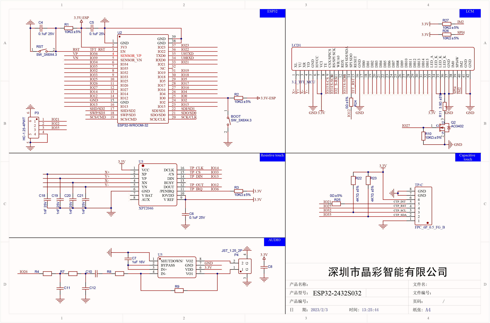
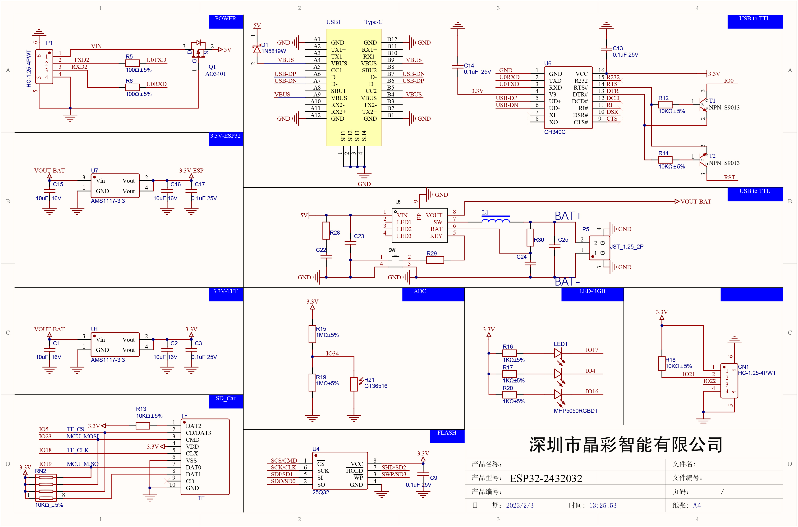

# ESP32-2432S032

One of the crappy little display variants. May have capacitive (C) or resitive (R) touch

A mirror of the files provided by sellers can be found on [github](https://github.com/kpeeem/3.2inch_ESP32-2432S032)

## Hardware

## Display

**driver**: ST7789 (SPI)

**resolution**: 240x320

| IO  | Function  | notes   |
| --- | --------- | ------- |
| 2   | DC        |
| 15  | CS        |
| 14  | SCK       |
| 13  | MOSI      |
| 27  | Backlight | HIGH=ON |
| 12  | MISO\*    |
| 25  | RST\*     |

## SD Card

| IO  | Function | notes |
| --- | -------- | ----- |
| 5   | CS       |
| 18  | CLK      |
| 19  | MISO     |
| 23  | MOSI     |

## Touch (C)

**driver**: GT911

| IO  | Function | notes |
| --- | -------- | ----- |
| 32  | SCL      |
| 33  | SDA      |
| 25  | RST\*    |
| 21  | INT      |

## Audio

| IO  | Function | notes |
| --- | -------- | ----- |
| 26  | I2S      |

## On-board LED

| IO  | Function | notes |
| --- | -------- | ----- |
| 4   | Red      |
| 16  | Green    |
| 17  | Blue     |

## Schemantic

